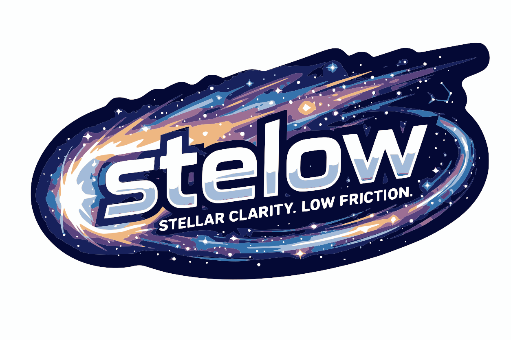

<p align="center">
  
</p>

# stelow · opinionated agentic product workflow, pi-first

[](https://deepwiki.com/calionauta/stelow)
[](https://zread.ai/calionauta/stelow)
[](https://github.com/calionauta/stelow/actions/workflows/ci.yml)
[](https://github.com/calionauta/stelow/actions/workflows/ci.yml)
[](https://github.com/calionauta/stelow/releases)
[](https://pi.dev)
[](https://muxy.app)
[](https://herdr.dev)
[](https://github.com/calionauta/stelow#cli-compatibility)

I'm trying to make ai agents behave less like coding assistants and more like cross-functional product team.

This package brings [Shape Up](https://basecamp.com/shapeup) methodology to AI coding agents. Instead of open-ended feature lists, you shape proposals with clear scope boundaries, validate them through adversarial critique, and generate typed technical scopes ready for autonomous execution.

> **Built by a former product manager and developer, for AI agents and humans.** I've led product teams, taught product leadership, advised product strategy, and written code across the full stack. stelow is that experience, systematized — no conference-room theory, no abstract architecture. Lessons from live products, shipped features, real teams, and real codebases. [More about my background.](#about-the-author)

---

> 🎯 *"Measure thrice, cut once"* - applies to product decisions, not just code.

**Key differentiators:**

- **Shape Up methodology for AI agents** - IN/OUT scope boundaries, appetite-driven sizing, risk analysis, focused scoping. Every proposal is a shaped bet, not a wishlist.
- **Appetite × Review Mode stage control** - Two orthogonal dimensions control the full workflow: how deep to prepare (Appetite: Lean / Core / Complete) and which gates run (Review Mode: Auto / Product Spec Gate / Product Spec + Interface Gates / Product Spec + Interface + Scopes / Product Spec + Interface + Tech Review). The cascade propagates automatically through critique depth, supervisor use, verification rigor, and gate requirements - no manual stage skipping needed.
- **Adversarial plan critique** - Plans are reviewed for gaps, risks, and assumptions by parallel (fresh context) reviewers, not just approved in chat.
- **Visual review gate** - Plannotator opens the full plan for point-by-point comments before implementation, not a rubber-stamp approval.
- **Appetite-scaled interface exploration** - 1, 3, or 5 ASCII archetypes plus hybrid depending on scope depth - no coded mockups wasted.
- **Product domain libraries** - 8 domains auto-detected from your language (Pricing, Trust, Ads, Promotions, Open Source, Health, Marketplace, Business Models).
- **Typed technical scopes** - feature, spike, optimize, test-* with dependency mapping and sequencing for autonomous execution.
- **Acceptance-based scope execution** - each scope is delegated with a contract (criteria, verify commands, stop rules). On acceptance-native harnesses (e.g. pi-subagents), the child self-corrects in the same context before returning. On other harnesses, the parent re-delegates with feedback until criteria pass or max iterations exhaust.
- **Audit gap-to-scope loop** — post-execution audit classifies gaps (FIXED / DOCUMENTED / ESCALATED). ESCALATED gaps become new scopes in the tracking file. `/sw-next` enforces the loop: when pending scopes exist at the Audit phase, it blocks completion and resets to Execution. The cycle repeats until no scopes remain pending.
- **Audit trail — full lineage record** — after execution, generates `audit-trail.md` linking every decision from origin to delivery: why it exists (appetite, intent), what was decided (IN/OUT, interface selection, trade-offs), what was committed (scopes, gates, dependencies), what actually happened (iterations, discovered tasks, records), and how it was validated (tests, reviews, audit). Every line links to the source artifact. View with `/sw-audit`, filter by scope with `--scope scope-1`, or export as JSON with `--format json`.
- **Scopes, Tasks & Records — three-layer execution model**. Scopes are appetite-bounded delivery units committed at planning (Lean ≤2, Core ≤5, Complete ≈10). Tasks are sub-item checklists inside a scope — planned tasks seed from the spec-tech table; discovered tasks emerge during execution (always with a `note:` explaining the trigger). Records capture claim-proof evidence (files touched, commands run, verification checklist) before a scope is closed. Validation is ON by default (set `STELOW_VALIDATE=0` to disable). See [`docs/scopes-tasks-flow.md`](docs/scopes-tasks-flow.md) for the full pipeline.
- **Bidirectional product ↔ tech flow** — tech constraints and opportunities inform product decisions *before* execution. Tech Preview uses cymbal for appetite-gated codebase recon; Alignment Check catches product-vs-tech misalignment with mode-dependent resolution (auto or user-flagged).
- **Stack-matched skills + fresh docs** — during execution setup, the workflow discovers skills (via `npx skills`) optimized for the chosen tech stack and fetches current library docs (via `ctx7`). Both skip if already installed or unavailable. Skills install in project scope only, after user confirmation.
- **Real-time TUI tracking** - see workflow state as it progresses through all stages.
- **Pulse — autonomous inbox processing** — background cron-driven system periodically checks your inbox and auto-creates workflows with `review_mode=Auto` (no gates, no questions). Items needing human review skip Pulse and land in the interactive inbox for manual triage, preventing silent loops on ambiguous requests.

---

## 📋 Table of Contents

- [Why stelow](#why-stelow)
- [🎚️ Appetite & Review Mode](#️-appetite--review-mode)
- [🔄 Process](#-process)
- [📋 Skills](#-skills)
- [🚀 Quick Start](#-quick-start)
- [📦 Installation](#-installation)
- [External Dependencies](#external-dependencies)
- [🎮 Commands](#-commands)
- [📡 Pulse — Autonomous Inbox Processing](#-pulse--autonomous-inbox-processing)
- [Setup per CLI](#setup-per-cli)
- [🖥️ Visual & TUI Integrations](#️-visual--tui-integrations)
- [📁 Artifact Directory](#-artifact-directory)
- [📖 Evidence & Limitations](#-evidence--limitations)
- [About the Author](#about-the-author)
- [License](#license)
- [📞 Support](#-support)

---

## Why stelow

> *"Let's go slow to go fast: invest time in thorough planning to gain speed and deliver value in execution."*

**Traditional AI development:** "Here's what I want. Start coding."

**With stelow:** The user just says:

```
/sw-start "Here's what I want to build"
```

And the workflow begins asking questions, exploring scope, shaping the proposal, reviewing for gaps, getting visual approval, and only then generating typed technical scopes for execution.

**Critique → Gate → Scope sequencing.** Execution (stage 12) only runs after all three pass. Lighter review modes (Auto/Product Spec Gate) skip some gates; the full path is there when you need it.

### The Problem

Building products with AI agents often leads to:

- Scope creep and unclear boundaries - defining *what not to build* is harder than *what to build*
- Plans without adversarial review - no one questions assumptions before coding begins
- Technical work before business validation - shipping features that shouldn't exist
- No systematic testing for AI-generated code - AI writes fast, but also writes wrong
- Generic workflows missing product-specific insights - pricing, trust, ads, and launch strategy are product decisions, not code decisions

### What stelow does

A structured workflow that makes AI think like a product manager:

- ✅ **Measure thrice, cut once** - shapes proposals with IN/OUT boundaries BEFORE coding
- ✅ **Strategic exploration** - Job To Be Done, Opportunity Mapping, Evolutionary Principles, Market Analysis, and Product Discovery knowledge integrated
- ✅ **Adversarial critique** - reviews every plan for gaps, risks, and assumptions
- ✅ **Visual review gate** - Plannotator opens the full plan for point-by-point comments (not just chat)
- ✅ **Interface exploration in ASCII art** - visualize 5 different approaches in seconds, no coding wasted, then LLM creates a hybrid version combining the best points for the context
- ✅ **Domain libraries** - auto-detects 8 product domains (Pricing, Trust, Ads, etc.) from your language
- ✅ **Technical scope mapping** - breaks down into typed scopes, maps dependencies, sequences execution
- ✅ **AI-aware testing strategy** - for software products, with coverage targets, CI gates, and contextual evaluation of mutation testing for critical paths
- ✅ **Greenfield & Brownfield** - works for new products and existing product evolution

### Key Features

- **25 skills total** in this repo: 1 orchestrator + 24 sub-skills (5 strategic approaches + 8 domain tactics + 11 utility skills)
- Part of a broader ecosystem — the orchestrator composes these and can also invoke additional skills from the user's agent environment at runtime
- Real-time TUI tracking with visual status overlay (`/sw-status`)
- Gate approval via Plannotator - review, comment, approve or reject before implementation
- Typed scopes for autonomous execution (feature, spike, test-*, optimize)

---

## 🎚️ Appetite & Review Mode

The workflow is controlled by two orthogonal dimensions: **Appetite** (declared by the human) and **Review Mode** (declared by the human). Appetite controls scope/exploration depth. Review Mode controls which gates, questions, and approvals are active.

### Appetite (Constraint, Not Estimate)

Appetite is the **scope and exploration budget** - how much product depth the human wants prepared before execution.

> **Appetite is a constraint, not an estimate.** Unlike traditional estimation (which asks "how long will this take?"), appetite asks "how much is this worth?" before the work is defined. This forces scope cuts to fit the budget - the budget never expands.
>
> This departs from the original Shape Up (37signals/Basecamp), where appetite is a fixed calendar window — 6 weeks — serving as a circuit breaker against scope creep. Under LLM execution, wall-clock time is not a predictable constraint: an agent can batch-parallelize, context-switch instantly, or stall on a single stubborn test. That makes time a poor governor for scope. Here, appetite caps **preparation depth** — spec size, number of scopes, interface variants considered, test layers required — not calendar duration. The scope, not the schedule, is what gets cut.

| Appetite | What it means | Scope depth | Interface exploration | Supervisor | Testing | Best for |
|----------|---------------|-------------|----------------------|------------|---------|----------|
| **Lean** | Validate an idea fast. Minimal scope ceremony. | 1 minimal feature, 1-2 scopes | 1 suggested interface; no alternative exploration | Low sensitivity | Smoke tests + critical-path unit tests; a11y lint/static if UI exists | Idea validation, spike, throwaway prototype |
| **Core (default)** | Standard product feature. Enough depth to catch obvious gaps. | Main JTBD, 3-5 scopes | 3 interface archetypes explored + 1 hybrid recommendation | Medium sensitivity | Unit tests + integration tests for external seams; a11y codebase/browserless audit if UI exists | Most features, bug fixes, small improvements |
| **Complete** | Multi-feature or high-risk product work. | 8-15 scopes, full edge mapping | 5 interface archetypes explored + 1 hybrid recommendation | High sensitivity | Unit + integration + behavior/e2e + security tests; live a11y audit if UI exists | Critical features, high-risk changes, production releases |

**Cut policy implied by appetite:**

| Appetite | What to cut first |
|----------|-------------------|
| **Lean** | Edge cases, secondary flows, alternative strategies, non-critical integrations. Keep only the happy path. |
| **Core** | Low-value variants. Keep the main JTBD, obvious edge cases, and one alternative only if it changes the core flow. |
| **Complete** | Cut nothing unless impossible. Keep full edge case mapping, multiple implementation strategies, and domain context. |

The Shape Up stage runs a mechanical check (scope count, spec size) and writes a preliminary `appetite_fit` in the spec frontmatter. The **Plan Critique** stage validates it via its fresh-context feasibility reviewer (see `cali-product-plan-critique` checklists — Scope Fit dimension). This uses the existing 5-reviewer infrastructure instead of adding a dedicated subagent.

| `appetite_fit` | Meaning |
|----------------|---------|
| `fits` | Proposal fits within appetite - proceed as shaped |
| `cuts_needed` | Proposal almost fits but needs targeted cuts (LLM suggests what; human decides) |
| `reshape` | Proposal fundamentally exceeds appetite - must be reshaped before continuing |

This is **not an estimate**. The LLM does not estimate effort - it checks whether the shaped design fits the human's declared budget. If it doesn't fit, the LLM proposes cuts or reshaping, never an appetite extension. The final decision is always human.

All three appetites benefit from `appetite_fit` validation by the **Plan Critique**'s fresh-context feasibility reviewer — this uses the existing 5-reviewer infrastructure, no dedicated subagent needed. The Shape Up stage provides only a preliminary mechanical check (scope count, spec size). This aligns `appetite_fit` with the workflow's convention: all critical evaluations use fresh context via the Plan Critique stage.

**Critique and Gate are Review Mode controls, not Appetite controls.** Product Critique and Plannotator Gate are governed by Review Mode: Auto skips gates; all other modes run the configured gates. Appetite changes the depth of the shaped proposal, interface exploration, supervisor sensitivity, and test scope breadth — not whether quality gates exist.

**Appetite-specific execution budget:**

| Area | Lean | Core | Complete |
|------|------|------|----------|
| **Spec + scopes** | ~1 page; 1-2 scopes; one direct implementation path | ~3 pages; 3-5 scopes; 1-2 implementation alternatives with brief rationale | ~8+ pages; 8-15 scopes; 3-5 alternatives with trade-offs |
| **Cut policy** | Cut edge cases, secondary flows, alternative strategies, non-critical integrations. Keep the happy path. | Cut low-value variants. Keep main JTBD, obvious edge cases, and one alternative only if it changes the core flow. | Cut nothing unless impossible. Keep full edge mapping, multiple strategies, and domain context. |
| **Interface exploration** | 1 suggested interface only | 3 archetypes explored + 1 hybrid recommendation | 5 archetypes explored + 1 hybrid recommendation |
| **Supervisor** | Low sensitivity | Medium sensitivity | High sensitivity |
| **Testing** | Smoke tests + critical-path unit tests | Unit tests + integration tests for external seams | Unit + integration + behavior/e2e + security tests |
| **Quality baseline** | Build/test/lint/typecheck always; a11y lint/static if UI exists | Build/test/lint/typecheck always; a11y codebase/browserless audit if UI exists | Build/test/lint/typecheck always; live a11y audit if UI exists |

### Review Mode

Review Mode controls the **breadth** of human review — which gates, questions, and approvals are active. Unlike Appetite (depth of scope), Review Mode determines the **level of human oversight** during the workflow.

Review Mode is set explicitly during the setup phase via `ask_user_question`. It is NOT auto-detected.

| Review Mode | Plannotator Gates | Interface | IN/OUT Confirmation | Tech Approval | Best for |
|---|---|---|---|---|---|
| **Auto** | None | LLM decides | LLM decides | Auto | Throwaway prototype, quick validation, spike |
| **Product Spec Gate** | **1 pre-tech** | LLM decides | LLM decides | Auto | Standard feature, bug fix, small improvement |
| **Product Spec + Interface Gates** | **1 pre-tech + Int.Gate** | **User chooses** | LLM decides | Auto | Feature where interface matters |
| **Product Spec + Interface + Scopes** | **Gate + Int.Gate** | User chooses | **User confirms** | Auto | Critical feature, product with domain context |
| **Product Spec + Interface + Tech Review** | **Gate + Int.Gate + Plan.Gate** | User chooses | User confirms | **Gate + tech Qs** | Full pipeline, high-risk changes, production |
| **Product Spec + Interface + Tech Review + Code Diff** | **Gate + Int.Gate + Plan.Gate + Diff.Gate** | User chooses | User confirms | **Gate + tech Qs + code diff** | Maximum oversight, critical infrastructure |

**Key rules:**

- **Auto:** No gates, no Plannotator, no questions. LLM decides everything. Quickest path.
- **Product Spec Gate:** One Plannotator gate (spec-product visual approval before tech planning). AI resolves all gaps. Interface auto-generated, no choice. No IN/OUT confirmation.
- **Product Spec + Interface Gates:** Product spec gate + interface gate. User chooses between generated interface alternatives. AI resolves trivial gaps, asks about moderate/critical.
- **Product Spec + Interface + Scopes:** All product gates active (pre-tech + scope IN/OUT + int-gate). User confirms boundaries. Tech approval uses Auto.
- **Product Spec + Interface + Tech Review:** Everything in product review + tech plan goes through Plannotator gate + user answers technical questions.
- **Product Spec + Interface + Tech Review + Code Diff:** All the above + Plannotator code diff review on the working tree after verification. Maximum human oversight for critical changes.

### How Appetite & Review Mode Interact

```
Review Mode controls WHAT runs (breadth)      →  Which gates are active
Appetite controls HOW DEEP it runs             →  Scope depth per gate
```

| | Lean | Core | Complete |
|---|---|---|---|
| **Auto** | No gates. Fastest path: smaller spec, minimal verify. | No gates. Standard planning depth, standard verify. | No gates. Deep planning, full verify. |
| **Product Spec + Interface + Scopes** | 2 gates (Gate + Int.Gate). User confirms IN/OUT. | 2 gates + IN/OUT confirmation. Full workflow. | 2 gates + all questions. No shortcuts. |
| **Product Spec + Interface + Tech Review + Code Diff** | 4 gates + plan-gate + diff-gate. Full review. | 4 gates + all questions. Max oversight. | 4 gates + all questions + code diff review. No shortcuts. |

**Examples:**
- `Lean + Auto` → Fastest path: no gates, no questions, no Plannotator. LLM decides scope. Interface runs automatically with 1 suggested interface. (~6 stages)
- `Core + Product Spec Gate` → Standard feature: 1 Plannotator gate (pre-tech), interface runs automatically with 3 interfaces + hybrid. (~10 stages)
- `Core + Product Spec + Interface Gates` → Feature where interface matters: 1 Plannotator gate + user chooses among 3 interfaces + hybrid. (~8 stages)
- `Complete + Product Spec + Interface + Tech Review` → Critical feature: 3 Plannotator gates + all questions. Interface explores all 5 archetypes + hybrid. No shortcuts. (~17 stages)
- `Complete + Product Spec + Interface + Tech Review + Code Diff` → Maximum oversight: 4 Plannotator gates + code diff review. All questions. All archetypes. (~17 stages)

### Motivation

Product ideas vary widely in scope and risk. A throwaway prototype should not require the same planning depth as a critical production feature. The Appetite × Review Mode cascade system ensures:

- **Lean appetite limits scope and exploration** - smaller spec, fewer scopes, one interface suggestion, and critical-path tests only.
- **Complete appetite expands exploration and verification** - full edge mapping, all 5 interface archetypes + hybrid, behavior/e2e tests, security tests, and live a11y audit when UI exists.
- **Auto review mode skips Plannotator** - for lightweight validations where visual review is overkill
- **Product Spec + Interface + Scopes review mode enforces strategy** - JTBD, Opportunity Mapping, etc. run before shaping if product context exists

This is an **appetite-first** design: the human's declaration of review budget propagates automatically through all stages - no estimation step required.

---

## 🔄 Process

The workflow has **3 conceptual phases** (17 stages total), from idea triage to post-execution audit. See the [Stage Index](#-skills) in the orchestrator skill for the complete stage map with auto-chain rules and flow diagram.

### 1. 🎨 Shaping

**Stages 0-11** — From raw idea through shaped proposal, adversarial critique, visual gate approval, interface exploration, to typed technical plan. **Stages 12** — Tech plan gate (conditional). **Stages 13+** — Execution onward.

#### Bidirectional Product ↔ Tech Flow

Traditional planning is linear: product spec → tech spec. stelow adds **two feedback loops** that let tech constraints and opportunities inform product decisions *before* execution:

- **Tech Preview** — Before shaping the product spec, a lightweight codebase analysis runs (via [cymbal](https://github.com/1broseidon/cymbal), when available) to surface existing architecture, entry points, hotspots, and constraints. This prevents shaping features that conflict with the codebase reality. Depth is appetite-gated. Additionally searches existing features by workflow name/topic to avoid duplicating or conflicting with what already exists.

- **Codebase Feature Recon** — Before tech planning generates typed scopes, a deeper cymbal investigation runs: searches for related modules, maps references (who connects to what), and analyzes impact (what breaks if changed). Depth varies by appetite — see table below.

- **Alignment Check** — After tech planning generates typed scopes, a bidirectional check compares the tech plan against the product spec. If tech reveals constraints that change the product scope, the LLM classifies alignment and acts per Review Mode: Auto/Product Spec Gate auto-updates the product spec; Product Spec + Interface Gates and above ask the user. This catches "tech discovered too late" before any code is written.

| Appetite | Tech Preview (shaping) | Codebase Feature Recon (planning) | Alignment Check |
|----------|----------------------|-----------------------------------|----------------|
| **Lean** | `cymbal search --text` by workflow name | `cymbal search --text` — verify existence | Quick feasibility |
| **Core** | Structure overview (entry points, hotspots) + feature search | `search` + `cymbal refs` — find connections | Standard IN/OUT vs feasibility |
| **Complete** | Structure + impact analysis (blast radius) + feature search | `search` + `refs` + `cymbal impact` — blast radius | Deep: each scope's ACs vs codebase |

Greenfield skips all codebase analysis (no code to inspect).
If cymbal is not installed, falls back to `find` + `git log` — no cross-references or impact data.

| Review Mode | Alignment Check behavior |
|------------|------------------------|
| **Auto/Product Spec Gate** | Auto-resolve. Updates spec-product if needed. No questions. |
| **Product Spec + Interface Gates** | Auto-resolve if aligned; flags user if misaligned. |
| **Product Spec + Interface + Tech Review / +Code Diff** | Always shows diff, asks user to choose update/ignore/reshape. |

These loops are **appetite- and mode-respecting by design** — they inherit the same two-axis control as the rest of the workflow. No new mechanism needed.

### 2. ⚡ Execution

**Stages 13-14** — Autonomous scope execution via acceptance contracts: each scope is delegated with criteria, verify commands, and stop rules. Self-correction is harness-dependent - native acceptance loops (pi-subagents) let the child fix gaps in the same context; other harnesses use parent-controlled re-delegation. Optimization scopes use benchmark-driven iteration. Scope completion is gated - `/sw-next` blocks advance to Verification if any scopes remain incomplete.

### 3. ✅ Verification & Audit

**Stage 14** — Verification (tests, code review, UI audit). **Stage 15** — Code diff review gate (conditional). **Stage 16** — Execution critique (scope fidelity, NFR coverage, edge cases, docs, test quality). The audit classifies gaps as FIXED / DOCUMENTED / ESCALATED. ESCALATED gaps become new scopes. `/sw-next` detects pending scopes at the Audit phase and loops back to Execution.

---

## 📋 Skills

All 25 skills are flat in `skills/` directory, ready for `~/.agents/skills/`. The breakdown:

| Role | Count | Skills |
|---|---|---|
| Orchestrator | 1 | `stelow-product-orchestrator` |
| Strategic approaches | 5 | Job-to-Be-Done, Evolutionary Principles, Opportunity Mapping, Discovery, Multi-Method Market Analysis |
| Domain tactics | 8 | Pricing, Trust, Ads, Health, Promotions, Business Models, Open Source, Marketplace Playbook |
| Product workflow | 5 | Shape Up, Plan Critique, Interface Alternatives, Tech Planning, Scope Executor |
| Code + UX + meta | 6 | Codebase Critique, Coding Standards, Testing AI Code, Testing Execution, UX Critique, Execution Critique |

5 + 8 + 5 + 6 = 24 sub-skills, plus 1 orchestrator = 25 total.

**Each skill is fully self-contained** - the installer copies the complete directory tree including its own `references/cli-tools/`, `references/`, and `stages/` files. This means:
- ✅ **Skills work standalone** - invoke any sub-skill (e.g., `cali-product-shape-up`, `cali-product-plan-critique`) independently of the orchestrator
- ✅ **Portable across agents** - Pi, Claude Code, Codex, Cursor, Continue, OpenCode, and others all reference skills by name (`~/.agents/skills/`)
- ✅ **References resolve locally** - every `references/cli-tools/*.md` path is relative to the skill's own directory
- ❌ **Not in `~/.agents/skills/`?** Use `./install.sh` or `npx skills add calionauta/stelow -g`

### 🎛️ Orchestrator (1)

| Skill | Purpose |
|-------|---------|
| `stelow` | Coordinates the multi-stage workflow (Setup → Context → Shape → Critique → Gate → Scope → Interface → Int.Gate → Selection → Planning → Plan.Gate → Execution → Verification → Diff.Gate → Audit) |

### 🧠 Product Strategies (5)

| Skill | Purpose |
|-------|---------|
| `cali-product-job-to-be-done` | Job To Be Done - understand what job users hire the product to do |
| `cali-product-discovery` | Product discovery and validation |
| `cali-product-opportunity-mapping` | Map opportunities to see where to focus |
| `cali-product-multi-method-market-analysis` | Multi-method market analysis |
| `cali-product-evolutionary-principles` | Evolutionary principles for sustainable development |

### ⚙️ Workflow Stages (10)

| Skill | Purpose |
|-------|---------|
| `cali-product-shape-up` | Shape Up planning + **Tech Preview** (appetite-gated codebase recon via cymbal) — surfaces codebase reality before product decisions |
| `cali-product-interface-alternatives` | Interface alternatives exploration (1/3/5 archetypes by appetite) |
| `cali-product-plan-critique` | Product plan gap analysis (flows, states, affordances, data, system, compositional quality, feasibility); mode-dependent resolution |
| `cali-product-codebase-critique` | Codebase structural critique (architecture, performance, AI slop) |
| `cali-product-ux-critique` | Full UX/UI audit (accessibility, Nielsen heuristics, personas, AI slop) |
| `cali-product-tech-planning` | Technical scope generation + **Alignment Check** (mode-gated bidirectional product↔tech feedback loop) |
| `cali-product-testing-ai-code` | AI-aware testing strategy with contextual mutation testing evaluation |
| `cali-product-testing-execution` | Post-implementation testing protocol |
| `cali-product-scope-executor` | Autonomous scope execution via acceptance contracts - child self-corrects (harness-dependent), parent evaluates final result |
| `cali-product-execution-critique` | Post-execution audit - classifies gaps as FIXED/DOCUMENTED/ESCALATED; ESCALATED gaps become new scopes |

### 📘 Product Tactics (8)

| Skill | Purpose |
|-------|---------|
| `cali-product-ads` | Advertising and growth channels |
| `cali-product-business-models` | Business model canvas and options |
| `cali-product-health` | Product health metrics |
| `cali-product-marketplace-playbook` | Marketplace dynamics |
| `cali-product-open-source` | Open source strategy |
| `cali-product-pricing` | Pricing strategy and tactics |
| `cali-product-promotions` | Promotions and campaigns |
| `cali-product-trust-building` | Trust-building mechanisms |

### 📐 Complementary (1)

| Skill | Purpose |
|-------|---------|
| `cali-product-coding-standards` | Self-contained coding standards - KISS, DRY, LoB, SoC, Fail Fast, YAGNI, file/function size limits |

---

## 🚀 Quick Start

This package is **built Pi-first** — but the 25 skills work across any agentskills-compatible agent (Claude Code, Codex, Cursor, OpenCode…). See the compatibility table in [Installation](#-installation) to pick your path; Pi gets the deepest integration, other harnesses get the skills + CLI fallback.

| Your situation | Recommended command | What you get |
|----------------|--------------------|-------------|
| **New to CLIs** (no Node, no agent) | `curl -fsSL https://raw.githubusercontent.com/.../setup.sh \| sh` | Node.js + pi.dev + all extensions + 25 skills |
| **Already use pi.dev** | `git clone ... && ./install.sh` | 25 skills + TUI overlay + slash commands |
| **Use another agent** (Claude Code, Codex, Cursor, OpenCode, etc.) | `npx skills add calionauta/stelow -g` | 25 skills — universal path, no extension guarantees |
| **Any CLI (skills only)** | `npx skills add calionauta/stelow -g` | 25 skills + cross-CLI support |

### Intent-Aware Start

`/sw-start` auto-detects what kind of request you're making:

```bash
/sw-start "reduce complexity of the codebase"
# → Detected as: Refactor
# → Pipeline: Planning → Execution → Verification → Audit
# → Skips Shape Up, Interface, all Gates

/sw-start "fix login crash when email is empty"
# → Detected as: Bugfix
# → Pipeline: Planning → Execution → Verification → Audit

/sw-start "create a new invoicing platform"
# → Detected as: New Product
# → Full pipeline: Setup → Shape → ... → Execution → Audit
```

If detection is ambiguous or incorrect, you can change the category before the workflow starts. This prevents token waste from running the full Shape Up pipeline on a simple bugfix.

### Drift-Aware Resume

`/sw-resume` checks for git changes before resuming a paused workflow. If files changed while paused, it warns you and asks for confirmation before proceeding.

See [docs/INSTALLATION.md](docs/INSTALLATION.md) for detailed options.
Per-agent configuration files (commands, install scripts) are in [`cli-agents/`](cli-agents/).

---

## 📦 Installation

### Compatibility

The shipped extension is Pi-first. The skills work in any agent that
reads `~/.agents/skills/<name>/SKILL.md` — the agentskills.io standard.

| Feature | Pi (extension) | Any agentskills-compatible agent |
|---|---|---|
| **25 skills (orchestrator + 24 partners)** | ✅ | ✅ (universal path) |
| **`/sw-*` slash commands (15)** | ✅ Native | ⚠️ Skill delegation via `~/.agents/skills/stelow-product-orchestrator` |
| **TUI overlay (real-time status, notification panel)** | ✅ | ❌ |
| **Plannotator visual gate** | ✅ | ⚠️ Manual (CLI binary via bash) |
| **Lifecycle hooks (session start, turn end, tool call)** | ✅ | ❌ |
| **Auto-sync scopes from spec-tech.md** | ✅ Extension | ❌ (skill instructs `bash` snippet) |
| **`ask_user_question` (structured prompts)** | ✅ | ⚠️ Falls back to chat prose |
| **Subagent delegation with `context: "fresh"` + `acceptance` contracts** | ✅ Via `pi-subagents` (tintinweb) | ⚠️ Native subagent only; no acceptance contract |
| **Supervision / overnight execution** | ✅ Via `pi-supervisor` | ❌ |

> **Bottom line:** The **25 skills run identically in any agent that reads `~/.agents/skills/`** — they execute the full Shape Up workflow (plans, critique, scopes, everything). The deep integration features (TUI overlay, slash commands, lifecycle hooks, Plannotator gate, auto-sync scopes, ask_user_question, subagent acceptance contracts) are native to Pi, which has the extension system to support them. Two agent-agnostic surfaces also read workflow state from `.stelow/` files on disk: the [Muxy.app](https://muxy.app/) webview panel and the [Herdr](https://herdr.dev) split-pane TUI plugin. Both work with any agent. On any agent, the workflow runs from chat + skill invocation; on Pi, it also runs from slash commands + TUI.
>
> **v0.45.0 narrowed the shipped surface to Pi-only.** Skills remain agent-agnostic. To add first-class support (TUI / gates / auto-sync) for a new agent, follow the [Adapter extension guide](cli-agents/COMMANDS.md#how-to-extend).

### Auto-sync scopes from spec-tech.md

A common pain point used to be initializing `wf.scopes[]` in `stelow.json` — it required the LLM to run a 20-line bash snippet during Execution phase setup, which most agents skipped. **Starting in v0.44.0, scopes auto-sync from `spec-tech.md` by convention:**

- **How:** Any `readTracking()` or `writeTracking()` call (Pi extension + Muxy panel) finds the latest `.stelow/{date}/{hash}/plans/spec-tech_*.md`, parses `[SCOPE-N]` blocks into `{ id, type, name, blockedBy, targetFiles, maxIterations }`, and writes them to `stelow.json` with `status: 'pending'`.
- **When:** First read/write after a workflow enters Execution phase with empty scopes (idempotent).
- **Re-sync on v2+:** Tracks `wf.specTechFile` — if spec-tech bumps to v2, scopes are re-synced automatically.
- **Mirror parity:** Pi (TypeScript) and Muxy (JavaScript / Electron sandbox) run separate parsers. They're tested in `tests/unit/parse-scopes-from-spec-tech.test.ts` against identical fixtures.
- **Agents without the Pi extension** see the auto-sync happen via the skill's instructions (a bash snippet parses spec-tech.md and writes `wf.scopes[]` to `stelow.json`). Less clean than the extension path but consistent across agents.

Known gaps (race window, legacy workflows without `dirHash`, phase-number drift) are tracked in [`docs/scope-lifecycle-gaps.md`](docs/scope-lifecycle-gaps.md).

---

## External Dependencies

stelow is designed to be **self-contained** — the 25 skills + installer cover the full workflow. Some features optionally integrate with external tools for enhanced capability. Every external dependency has a documented fallback.

| Dependency | Required? | Used by | Install method | Fallback if absent |
|---|---|---|---|---|
| [cymbal](https://github.com/1broseidon/cymbal) | Optional | Tech Preview, Codebase Feature Recon, Alignment Check | `brew install 1broseidon/tap/cymbal` (macOS), or `go install` / binary release | Basic `find` + `git log` — no cross-references or impact data |
| [npx skills](https://github.com/vercel-labs/skills) | Optional | Stack-matched skill discovery during execution setup | Part of Node.js ecosystem (`npx` bundled with npm) | Skip — workflow runs without stack-matched skills |
| [ctx7](https://github.com/upstash/context7) | Optional | Current library doc fetching during execution setup | `npx @vedanth/context7` (auto-install via npx) | Skip — docs not fetched (less informed execution) |
| [sem](https://github.com/Ataraxy-Labs/sem) | Optional | Entity-level diff in Execution Critique (functions, types, methods instead of raw lines); enhanced changelog + bump detection in releases | `curl -fsSL https://raw.githubusercontent.com/Ataraxy-Labs/sem/main/install.sh \| sh` (macOS / Linux), `winget install AtaraxyLabs.sem` (Windows), `brew install sem-cli` (macOS / Linuxbrew) | `git diff` — raw line-level only, no structural awareness |
| [plannotator](https://plannotator.ai/) | Optional | Visual review gate annotation | Pi: `@plannotator/pi-extension` (other agents: `plannotator annotate ... --gate --json` via bash) | Manual review with approval receipt file — no structured annotation |
| [safe-change (pi-agent-codebase-workflows)](https://github.com/PriNova/pi-agent-codebase-workflows) | Optional | Pre-execution code safety checks | `npx skills add Prinova/pi-agent-codebase-workflows -g` (works in any agent that installs from skill registries) | Skip — pre-execution check omitted |
| Subagents (built-in to any agent) | Optional | Parallel reviewer orchestration during Plan Critique | `subagent(...)` / agent native subagent | Sequential execution — slower, same outcome (single-context review) |
| [pi-subagents](https://github.com/tintinweb/pi-subagents) | **Recommended for Pi** | `Agent()` tool, `inherit_context: false` (fresh by default), `run_in_background: true` for parallelism, `get_subagent_result()` for results, built-in `contact_supervisor` for child↔parent communication. Agents: `general-purpose`, `Explore`, `Plan` + custom `.md` agents. | `npm:@tintinweb/pi-subagents` | Without it: scope-executor falls back to parent-controlled loop (slower); no agent types — embed role in prompt |

> **Note:** stelow's cli-tools (`references/cli-tools/subagents.md`) document the invocation syntax. The orchestrator reads `detected_cli` from `index.json` and emits the correct shape — no skill changes needed when switching subagent extensions.
| [pi-supervisor](https://github.com/tintinweb/pi-supervisor) | Optional (Pi only) | Conversation supervision during execution | `npm:pi-supervisor` | Skip — no supervision; rely on `stages-guard` for invariant enforcement |
| [Muxy.app](https://muxy.app/) + stelow Muxy extension | Optional (macOS) | Webview panel showing workflow state with phase progress and quick actions | Install Muxy.app, then load extension from `integrations/muxy/stelow/` | No webview — read `.stelow/` files directly or use Herdr split-pane TUI |
| [herdr](https://herdr.dev/) + stelow plugin | Optional | Split-pane TUI showing workflow state with click-to-drill | `herdr plugin install calionauta/stelow` | No TUI — read `.stelow/` files directly or use Muxy webview panel |

**Design principle:** stelow is **Pi-first, skills-agnostic**. The 25 skills run identically in any agent that reads `~/.agents/skills/` — the full Shape Up workflow (plans, critique, scopes) works everywhere. The deep integration layer (TUI overlay, `/sw-*` slash commands, lifecycle hooks, Plannotator gate, auto-sync scopes, subagent acceptance contracts, supervision) is native to Pi, which has the extension system to support it. Other harnesses get the skills + CLI fallback; Pi gets the full experience. No external tool is *required* to run the workflow — each optional integration enhances a phase but never blocks progress. The installer (`./install.sh`) auto-installs Pi npm packages when Pi is detected — other tools (cymbal, ctx7) remain user-managed.

For every external tool above, the workflow teaches the agent the **specific fallback strategy** in `skills/stelow-product-orchestrator/references/cli-tools/<tool>.md`. When a tool is unavailable, the orchestrator instructs the agent to use harness-native capabilities (built-in `subagent()`, `git grep`, terminal-based review with approval receipts) rather than skipping the workflow step entirely. Degraded capability is the trade-off — see the Fallback column above for what you lose without each tool.

### 🚀 Path A: From Zero (pi.dev + Everything)

**One command, everything included.** Pick this if you don't have pi.dev yet.

```bash
curl -fsSL https://raw.githubusercontent.com/calionauta/stelow/main/setup.sh | sh
```

**What gets installed (in order):**

| Step | Component | Details | Works on |
|---|---|---|---|
| 1 | Node.js | v20+ via Homebrew (macOS) or nvm (Linux/Windows) | - |
| 2 | pi.dev | `@earendil-works/pi-coding-agent` via npm | pi.dev |
| 3 | Pi extensions | @tintinweb/pi-subagents, @tintinweb/pi-tasks, pi-skillful, pi-intercom, pi-supervisor, @plannotator/pi-extension, pi-rewind, pi-powerline-footer, plus harness tooling | pi.dev only |
| 4 | Skills (25) | stelow orchestrator + 24 subskills, copied to `~/.agents/skills/` | **All CLIs** ✅ |
| 5 | Settings | theme, model defaults, skill shortcuts in `~/.pi/agent/settings.json` | pi.dev |
| 6 | cymbal | codebase navigation via `brew install 1broseidon/tap/cymbal` (macOS) or `go install` (Linux). Skipped gracefully if brew/Go absent | macOS, Linux |
| 7 | ctx7 | library docs fetcher via `npx @vedanth/context7` (interactive OAuth — prompts the user) | All CLIs |
| 8 | safe-change | pre-planning regression check via `npx skills add PrinNova/pi-agent-codebase-workflows -g` | All CLIs |
| 9 | Herdr plugin | stelow split-pane TUI installed via `herdr plugin install calionauta/stelow` — **only if** `herdr` CLI is on PATH | All CLIs (via Herdr) |
| 10 | Muxy detection | detects `/Applications/Muxy.app` or `muxy` binary; prints install link if absent (cannot auto-install — Muxy is macOS-only, distributed via GitHub releases) | macOS |
| 11 | Pulse (optional) | copies Pulse scripts to project's `.stelow/pulse/` and creates inbox. Or run standalone: `./scripts/setup-pulse.sh` (no pi required — works in CI/CD or before pi is installed) | All CLIs (cron/launchd/systemd/Task Scheduler) |

> **Not using pi.dev?** Skills land in `~/.agents/skills/` and work on any agent that reads them. You just won't get the Pi-only extensions or TUI overlay. The workflow itself runs fine — see [agentskills.io](https://agentskills.io/) for the cross-agent standard.
>
> **Muxy.app can't be auto-installed.** It's a macOS-only app (SwiftUI + libghostty), open-source under MIT license, distributed via [GitHub releases](https://github.com/muxy-app/muxy/releases). Path A detects whether it's present and tells you how to install if not. Once installed, load the stelow extension from `integrations/muxy/stelow/`.

### 📋 Path B: Existing pi.dev User

```bash
git clone https://github.com/calionauta/stelow.git
cd stelow
./install.sh
```

The installer auto-detects your CLIs and installs skills + extensions + slash commands. Skills go to `~/.agents/skills/`.

### 📋 Path C: Any other agent (universal)

The **skills** are the core of this project - they work on **any** agent that reads `~/.agents/skills/<name>/SKILL.md` (the agentskills.io standard).

```bash
git clone https://github.com/calionauta/stelow.git
cd stelow
./install.sh
```

The installer detects your CLI and installs **skills + command files**. No extensions, no TUI - just the 25 skills that run the workflow.

**Or, with npx (no clone needed):**

```bash
npx skills add calionauta/stelow -g
```

This installs all 25 skills to `~/.agents/skills/` - works on any CLI.

> For per-agent configuration (if your agent needs more than the universal skill path), see [docs/INSTALLATION.md](docs/INSTALLATION.md).

### Manual setup & dependencies

For per-CLI commands, required npm packages, third-party skills, and updates, see [docs/INSTALLATION.md](docs/INSTALLATION.md).

For toolchain dependencies (TypeScript, Vitest), see [package.json](package.json).

This project distributes exclusively via GitHub (no npm) — see [docs/SECURITY.md](docs/SECURITY.md) for rationale.

---

## 🎮 Commands

### Primary Commands

| Command | Description |
|---------|-------------|
| `/sw-start [idea]` | Start new workflow. Auto-detects intent type and routes to appropriate stage pipeline. If called without arguments, reads from inbox (`.stelow/inbox/items.md`). If the input contains multiple items, auto-runs **triage** (group) + **select** (pick one). |
| `/sw-status` | Show active workflow phase list, stage progress, and scopes. |
| `/sw-next` | Advance to next stage. Auto-completes workflow on last phase. |
| `/sw-pause` | Pause active workflow (keeps state for resume). |
| `/sw-resume [name=]` | Resume paused/in-progress workflow. Checks git drift before resuming. |
| `/sw-abort [name=]` | Abort and archive active workflow. |
| `/sw-archive [name=]` | Archive completed or inactive workflow. |
| `/sw-unarchive name=` | Restore archived workflow to paused state. |
| `/sw-status` | Display current phase, progress, and scope status. |
| `/sw-ls [all\|archived]` | List workflows in current project (or all projects). |
| `/sw-setphase phase=N` | Jump to specific phase by index. |
| `/sw-info [name=]` | Print workflow path, current stage, and copy-pasteable `cd` + `/sw-resume` commands. |
| `/sw-rename <name>` | Rename active workflow. |
| `/sw-complete` | Force-complete active workflow. |
| `/sw-inbox [add\|remove\|clear\|history]` | View or manage deferred inbox items. |
| `/sw-pulse` | Manage autonomous inbox processing (see Pulse section below). |
| `/sw-doctor [--fix]` | Diagnose workflow health. Detects zombie workflows, index mismatches, orphaned entries. |
| `/sw-unlock` | Disable stage guard for current session (debug only). |

> All 15 commands work in **Pi** natively (via `pi.registerCommand()`). In any other agent, the same 15 commands route through the **orchestrator skill** — invoke `/skill:stelow-product-orchestrator <command>` and the skill handles phase routing, gate calls, and state writes. The exceptions are `/sw-inbox` and `/sw-pulse`, which are marked `piOnly` because they operate on filesystem state with native TUI notifications; in non-Pi agents, the agent falls back to reading files directly.

---

## 📡 Pulse — Autonomous Inbox Processing

Pulse is a background system that periodically checks your inbox and creates workflows automatically — no interactive session needed. It runs on a timer (cron, launchd, systemd, Task Scheduler) and processes items with `review_mode=Auto` (no gates, no questions, no Plannotator).

```
cron/launchd/systemd (every 30m)
  → pulse.sh / pulse.ps1
    → checks inbox (.stelow/inbox/items.md)
    → runs `pi --print` with triage prompt
    → creates workflow(s) with review_mode=Auto
    → logs provenance to .stelow/inbox/history.jsonl
```

| Command | Purpose |
|---------|---------|
| `/sw-pulse status` | Show pulse state (paused, inbox count, last run) |
| `/sw-pulse pause` | Pause automatic processing |
| `/sw-pulse resume` | Resume automatic processing |
| `/sw-pulse process` | Force immediate processing |
| `/sw-pulse log [n]` | Show last N log entries |

| Flag / Env | Default | Description |
|------------|---------|-------------|
| `--max-items N` | `10` | Items per cycle. `0` = uncapped (all). `1` = one at a time |
| `--force` | — | Skip pause + user-activity checks |
| `--dry-run` | — | Preview without executing |
| `PULSE_MODEL` | — | Optional. Override harness's configured model for `pi --print`. If unset, uses whatever the user's harness is configured with (no hardcoded default). |
| `PULSE_TIMEOUT` | `120` | Max seconds for `pi --print` |
| `PULSE_USER_ACTIVITY_MINUTES` | `15` | Skip if user modified `stelow.json` recently |

**Marking items for human review:** Prefix an inbox item with `[human-in-the-loop]` (or `[hitl]`) — Pulse skips it entirely. Use for items that need human judgement (pricing, partnership, strategy). Items without the marker are processed automatically.

**Conflict prevention:** Pulse detects active user sessions (modified `stelow.json` mtime + interactive `pi` process) and skips automatically. Lock file prevents concurrent runs.

**Setup guides:** See `.stelow/pulse/SETUP.md` for macOS (launchd), Linux (systemd/cron), and Windows (Task Scheduler + PowerShell).

**Getting the scripts:** The stelow extension auto-copies Pulse scripts to `.stelow/pulse/` on the first `/sw-pulse` invocation. To pre-stage (no pi required, useful for CI/CD or before the extension is installed): `./scripts/setup-pulse.sh [--project-dir DIR] [--dry-run]`.

---

## Setup per CLI

When working on software projects, trigger the product workflow:

1. **Trigger:** Use `/skill stelow`
2. **Execute:** Only after visual review gate (Plannotator approval)

| CLI | File |
|-----|------|
| **Pi** | `~/.pi/agent/AGENTS.md` |
| **Any agentskills-compatible agent** | The orchestrator skill reads `~/.agents/skills/stelow-product-orchestrator/SKILL.md` automatically |

---

## 🖥️ Visual & TUI Integrations

Two CLI-agnostic surfaces read workflow state from `.stelow/` files on disk and present it alongside your terminal. Pick one or both — they share no code and don't require each other.

| Surface | Host | UI model |
|---|---|---|
| **Muxy webview panel** | [Muxy.app](https://muxy.app/) (macOS terminal multiplexer) | `WKWebView` docked/floating panel with HTML/CSS/JS |
| **Herdr split-pane TUI** | [Herdr](https://herdr.dev) (terminal multiplexer) | Rust+ratatui TUI in split pane (`placement = "split"`) |

Muxy plugin           |  Herdr Extension
:-------------------------:|:-------------------------:
  |  

Herdr Extension

Both integrations share the same workflow state (`.stelow/`), both work with any agent (Pi, or any agent that reads `~/.agents/skills/`), neither requires pi.dev.

### Muxy Webview Panel

> **Requires [Muxy.app](https://muxy.app/) + the stelow extension loaded.** Muxy is a **macOS terminal multiplexer** — think tmux with a native Mac UI: project-based terminal workspaces, tabs, splits, and custom panels. The webview panel is a Muxy plugin surface, not a web app or a Pi feature.

The panel shows:

- Current phase and progress
- Phase artifacts and outputs
- Upcoming tasks
- Quick actions
- **Cross-workflow scope view** — flat scope cards across all
  workflows in the active worktree, grouped by status (Pending / In Progress /
  Escalated / Failed / Completed). Filter strip by status or free-text.
  Project picker for switching between known Muxy projects.

**Install:** Muxy.app (macOS-only) + the stelow Muxy extension at `integrations/muxy/stelow/`. To load the extension in Muxy: open **Extensions modal → Create**, pick the folder, and Muxy auto-detects the built `dist/`. See [Muxy's Get started guide](https://muxy.app/docs/extensions/get-started) for the official workflow.

### Herdr Split-Pane TUI

> **Requires [Herdr](https://herdr.dev/) + the stelow plugin installed.** Herdr is a **terminal multiplexer** — tmux-style persistence, mouse-native panes, agent state tracking, CLI + socket API. The TUI plugin runs as a Rust binary in a split pane, the same model as `herdr-file-viewer`.

The TUI shows:

- Current stage (Discovery → Shape Up → Tech Planning → ...)
- Per-stage status (✓ done, ▶ active, · pending, ! blocked)
- Drill-down: stage → project → scope → task
- Quick action invocation via `herdr plugin action invoke`

**Keybinds:** `prefix+w` toggle · `Tab`/`j`/`k` next/prev workflow · `r` refresh · `?` help · `q`/`Esc` quit. Detail card shows prompt + current stage + scope; click workflow rows to select.

**Install:** `herdr plugin install calionauta/stelow` (or `herdr plugin link integrations/herdr/stelow/` for local dev after `cargo build --release`). Source under `integrations/herdr/stelow/`. See [herdr's plugin docs](https://herdr.dev/docs/plugins/) for the official install/link workflow.

---

## 📁 Artifact Directory

All workflow artifacts live under `<project>/.stelow/`. The layout below is generated automatically by the extension and skills — you never need to create these manually.

### Top-level

| Path | Contents | Generated by |
|------|----------|---------------|
| `stelow.json` | Local tracking — workflow metadata, scopes, status | Extension |
| `~/.stelow-global.json` | Global index — catalog of all workflows across projects | Extension |
| `inbox/items.md` | Deferred items from previous sessions | Triage / user |
| `inbox/history.jsonl` | Append-only provenance log (one JSON line per event) | `provenance.ts` |
| `lessons-learned/` | Cross-cycle patterns generated by Execution Critique | Audit stage |
| `session-knowledge/` | Passive context notes saved by the user mid-session | User (manual) |
| `pulse/` | Autonomous inbox processing scripts + config | Pulse setup |

### Per-workflow: `.stelow/{YYYY-MM-DD}/{dirHash}/`

| Path | Contents | Generated by | Stage |
|------|----------|---------------|-------|
| `index.json` | Workflow metadata (phase, status, artifacts map, config) | Extension | Any |
| `specs/spec-product_v{N}.md` | Shaped product proposal with IN/OUT, appetite, risks | Shape Up | 4 |
| `interfaces/interfaces_v{N}.md` | Interface proposals (1–5 archetypes + hybrid) | Interface Alternatives | 8 |
| `plans/spec-tech_v{N}.md` | Typed scopes, dependencies, tasks table, target files | Tech Planning | 11 |
| `plans/scopes/` | Scope detail files | Tech Planning | 11 |
| `critiques/critique-report.md` | Adversarial gap analysis (flows, states, feasibility) | Plan Critique | 5 |
| `approvals/` | Gate approval receipts | Gate stages | 6, 9, 12, 15 |
| `sessions/checkpoint.json` | Session checkpoint for resume | Extension | Any |
| `execution/iteration-state-{SCOPE-ID}.md` | Per-scope execution record (tasks, evidence, checklist) | Scope Executor | 13 |
| `execution/scope-{N}/events.jsonl` | Per-scope event log (delegate, verify, completed, escalated) | `event-logger.ts` | 13 |
| `verification/code-quality-review.md` | Code quality review output (lint, thermo-nuclear) | Verification | 14 |
| `group-context/manifest.json` | Triage group manifest (when multiple items grouped) | Triage grouping | 0 |
| `checklist.md` | Current phase task checklist (Plannotator-visible) | LLM (todo tool) | Any |

### Plannotator: `.plannotator/approvals/{dirHash}/`

| Path | Contents | Generated by |
|------|----------|---------------|
| `gate-approved.md` | Gate approval receipt with timestamp + method | Plannotator |

> **Convention:** `{dirHash}` is a stable random identifier (e.g. `sw-abc123-xyz789`) generated at workflow creation. The display name may change via `/sw-rename`, but the directory hash stays constant.

---

## 📖 Evidence & Limitations

### ✅ Evidence-Based Design

This workflow is grounded in empirical evidence from the 2025-2026 AI agent research boom. Every architectural decision - from parallel subagent orchestration to cross-session learning - is backed by peer-reviewed papers, open-source tools, and industry benchmarks.

| Practice | Source | Evidence | Where We Implement |
|----------|--------|----------|-------------------|
| **Parallel orchestration** | [CAID](https://arxiv.org/abs/2603.21489) (Geng & Neubig, CMU, 2026) | +26.7% accuracy using git-worktree isolation + dependency DAG | 5 parallel reviewers + consolidator during plan critique |
| **Cross-session learning** | [Cat](https://arxiv.org/abs/2512.22087) (Liu et al., Beihang, 2025); [Memory Transfer](https://arxiv.org/abs/2604.14004) (Kim et al., KAIST, 2026) | Context as callable tool; +3.7% via abstract memory pools | Session knowledge from past cycles read during workflow setup |
| **Output validation guards** | [Stage-Gate Agentic](https://community.pdma.org/knowledgehub/bok/product-innovation-process/stage-gate-agentic-the-coming-revolution-in-the-new-product-process) (PDMA, 2026); [Phaselock](https://github.com/infinri/Phaselock) (2026) | AI agents with gates reduce execution failures; 80 enforceable rules | Shape Up output guard + Tech Planning validation guard |
| **Context isolation** | [Clean Context Pattern](https://agentfactory.panaversity.org/docs/General-Agents-Foundations/context-engineering/context-isolation) (Agent Factory, 2026); [GAM](https://arxiv.org/abs/2604.12285) (Zhejiang U., 2026) | Fresh context per agent outperforms shared pipelines; write isolation prevents contamination | `subagents.md` - `context:"fresh"` per subagent; disk-based artifacts |
| **Visual review gate** | [Plannotator](https://plannotator.ai/) (backnotprop, 2025); [Placement Theory](https://tianpan.co/blog/2026-04-17-hitl-placement-theory-approval-gates) (Tian Pan, 2026) | Browser-based plan annotation with structured feedback loop | Plannotator gate active when Review Mode > Auto; skipped in Auto |
| **Intra-step recovery** | [Try-Heal-Retry](https://adriennevermorel.com/notes/try-heal-retry-pattern/) (Nweke, 2026); [PALADIN](https://arxiv.org/abs/2509.25238) (Chaudhary et al., 2025) | 89.68% recovery rate via annotated failure trajectories | `subagents.md` - Retry 1× + skip with logged error per subagent |
| **Parallel review isolation** | [CooperBench](https://arxiv.org/abs/2601.13295) (Khatua et al., 2026) | 2-agent cooperation → 25% success vs 50% solo; monotonic decline from 68% (2 agents) to 30% (4 agents) | Plan Critique uses fresh-context subagents with zero inter-agent communication and independent file outputs |
| **Communication topology limits** | [clawRxiv 2604.00736](https://clawrxiv.io/abs/2604.00736) (2026) | Overhead grows quadratically: C(n)=0.023n²+0.04n; 50% at n=7; agents inflate 34% when aware of peers | Max 4-5 parallel subagents (n≤5 optimal zone); no message passing between agents — each writes independent file |
| **Research vs code parallelism** | [Co-Coder](https://arxiv.org/abs/2606.00953) (Yang et al., 2026) | Parallel speedup requires cohesion-aware partitioning (+14% pass rate, 2.10× speedup); naive file-parallel = worse than sequential | Research/review tasks are naturally cohesion-free; code execution defaults to sequential; parallel scope execution is opt-in via post-hoc `git diff --name-only` overlap capture (observed, not predicted) |
| **Metric-driven optimization** | [ReflexGrad](https://arxiv.org/abs/2511.14584) (Kadu et al., 2025); [ReliabilityBench](https://arxiv.org/abs/2601.06112) (Gupta et al., 2026) | +40pp lift via dual-process routing; standardized reliability measurement | `optimization` scopes routed to optimization goals (subagent + acceptance) |
| **Acceptance-based execution** | Pattern inspired by [Try-Heal-Retry](https://adriennevermorel.com/notes/try-heal-retry-pattern/) (Nweke, 2026) and [PALADIN](https://arxiv.org/abs/2509.25238) (Chaudhary et al., 2025) | Self-correction in same context outperforms fresh re-delegation | Scope executor delegates with acceptance contract - child self-corrects (harness-dependent) before parent evaluates |
| **Audit gap-to-scope loop** | Pattern inspired by [Agentic Debugging](https://arxiv.org/abs/2504.18032) (Zhang et al., 2025) | Multi-agent feedback loops improve fix rate | Audit classifies gaps → ESCALATED become new scopes → `/sw-next` enforces loop back to Execution |

> **Research parallelism, not code parallelism.** All subagent parallelism in stelow is **research and review** — Plan Critique (4-5 parallel reviewers), Strategic Context (N skill executors), Interface exploration (5 proposals). Every reviewer receives fresh context, writes to an independent file, and communicates **zero** with other agents. No message passing, no shared mutable state, no concurrent code edits. This avoids the "curse of coordination" deliberately: [CooperBench (2026)](https://arxiv.org/abs/2601.13295) shows 2-agent cooperation achieves only 25% success vs 50% solo, with monotonic decline as agents increase (68% → 46% → 30% from 2→3→4 agents). Communication overhead scales quadratically ([clawRxiv 2604.00736](https://clawrxiv.io/abs/2604.00736): C(n)=0.023n², 50% of tokens lost to coordination at n=7 agents). For code execution, stelow defaults to **sequential scope execution** — each scope runs in a single agent turn, no parallel file edits. Parallel scope execution is opt-in: the orchestrator may dispatch DAG-independent scopes concurrently, then capture `git diff --name-only` per scope to detect observed file overlaps (post-execution). No pre-execution heuristic; overlap is only known AFTER execution. If overlap is detected, the report flags it for human decision (sequential re-run, merge, or rework). Research parallelism shows consistent gains ([+26.7% accuracy, CAID 2026](https://arxiv.org/abs/2603.21489)); code parallelism on shared files degrades quality ([CooperBench 2026](https://arxiv.org/abs/2601.13295)). Stelow uses each pattern where evidence supports it.

### ⚠️ Known Limitations & Radical Transparency

Even with these guardrails, the AI agent still exhibits predictable failure modes. This workflow is a tool for **amplifying human judgment**, not a substitute for it.

**How to read this table:** Each row is honest about what the workflow can and cannot do. Every mitigation has a corresponding "not solved" assessment. Read both before deciding whether this workflow helps your context.

| # | Limitation | Impact | What the workflow tries to do | Why it's not solved |
|---|-----------|--------|------------------------------|---------------------|
| 1 | **Context rot** - compliance with own rules drops from ~73% (turn 5) to ~33% (turn 16) in long sessions | [Gamage 2026](https://arxiv.org/abs/2604.20911), 4,416 trials, 12 models/8 providers. Replicated by Liu et al. 2023 "Lost in the Middle". | Subagents use `context: "fresh"`. Ordered-execution-goal creates isolated scope execution. Execution stage has explicit "Context Rot Check" re-reading plan from disk. | **Reduced but not solved.** The orchestrator itself can forget its own rules in long sessions spanning multiple stages. The core transformer limitation (U-shaped attention curve) remains intrinsic. |
| 2 | **Confabulated research references** - Agents cite nonexistent papers or books (~11-57% hallucination rate across models) | [arXiv 2604.03173](https://arxiv.org/abs/2604.03173) - 10 models/3 databases/69K citation instances | Claim verification via Lessons Learned cross-referencing during setup. | **Caught by structure, not guaranteed.** Multi-model consensus (≥3 LLMs citing same work) yields 95.6% accuracy, but the workflow doesn't enforce this. |
| 3 | **Silent wrong answers** - Cross-task state leakage produces plausible but incorrect outputs | [UCC (arXiv 2604.01350)](https://arxiv.org/abs/2604.01350), 2026 | Write isolation per subagent; clean context pattern | **Mitigated by isolation, not by detection.** No mechanism to detect when contamination happens despite isolation. |
| 4 | **Overconfidence in estimates** - AI systematically underestimates implementation complexity | [Agentic Overconfidence (ICLR 2026)](https://openreview.net/forum?id=Ld4bvamfKj) - all tested agents exhibit agentic overconfidence | Appetite is declared by human as a **constraint**, not estimated by the LLM. The LLM only checks `appetite_fit` (fits/cuts_needed/reshape). No estimation step. | **Addressed by design - appetite is a constraint, not an estimate.** The human sets the budget before shaping. The LLM checks fit, not effort. But the human still needs to set appetite honestly. |
| 5 | **Approval gate fatigue** - Users can desensitize to visual gates and approve without scrutiny | [Tian Pan Apr 2026](https://tianpan.co/blog/2026-04-23-hitl-queue-dynamics-approver-fatigue) - HITL queues have dynamics | Plannotator requires active annotations (deletions, comments, labels). Auto/Product Spec Gate review modes skip gates entirely when appropriate. | **Delayed, not prevented.** Review Mode selection helps reduce unnecessary gates, but if the human always picks Complete+Product Spec + Interface + Scopes, fatigue still sets in. |
| 6 | **80% Problem** - AI ships the happy path (CRUD, main flow) but omits error handling, observability, security, retry, rollback, edge cases | [Osmani Jan 2026](https://addyo.substack.com/p/the-80-problem-in-agentic-coding) (coined the term); [GitClear 2025](https://www.gitclear.com/ai_assistant_code_quality_2025_research) | Tech Planning requires NFRs per scope. Acceptance contracts can include NFR criteria (if the plan specifies them). Audit classifies omissions as gaps - ESCALATED ones become new scopes. | **Partially mitigated, not solved.** NFRs must be in the plan to appear in the contract. Audit classification depends on the LLM - misclassification means gaps slip through. Same model evaluates both stages. |
| 7 | **Model dependency** - Claude Opus, Gemini Flash, GPT-4o produce significantly different quality | [Veracode 2025](https://www.veracode.com/wp-content/uploads/2025_GenAI_Code_Security_Report_Final.pdf) - 45% of AI-generated code contains flaws across 100+ models; [Anthropic Jan 2026](https://arxiv.org/abs/2601.20245) - RCT: AI-assisted devs score 17% lower on comprehension tests | Every artifact tracks `generated_by: {model_name}` in frontmatter. Gate stage shows provenance before Plannotator review. | **Transparency, not mitigation.** Knowing the model helps calibrate expectations, but it doesn't fix the quality gap. The comprehension penalty (Anthropic 2026) affects users regardless. |
| 8 | **Constraint decay** - AI progressively violates its own self-imposed rules over time | [arXiv 2026 (Constraint Decay)](https://arxiv.org/abs/2605.06445) - structural constraints drift in backend code generation; [HORIZON](https://arxiv.org/abs/2604.11978) - agents break on long-horizon tasks | Context rot rules explicitly warn about this. "No patching in degraded context" rule blocks the most common decay pattern. | **Same root cause as context rot.** The warning helps, but stopping a session mid-flow is disruptive and users rarely do it. |
| 9 | **Code hallucination** - AI invents APIs, functions, or contracts that don't exist (~20% of failures) | [CloudAPIBench](https://arxiv.org/abs/2407.09726) - 20.41% of failures are hallucinated APIs; [Code LLM failures](https://arxiv.org/abs/2407.06153) | Verification stage runs the test suite, which catches some hallucinated APIs. | **Caught by tests, not by the workflow.** If tests don't exist (or are also hallucinated), neither Verification nor Critique detects it. |
| 10 | **Shallow review trap** - same LLM that wrote the code also reviews it | [Ox Security 2025](https://www.ox.security/wp-content/uploads/2025/10/Army-of-Juniors-The-AI-Code-Security-Crisis.pdf) - 300+ repos, 10 anti-patterns, AI code in production with critical flaws | Verification uses `context: "fresh"` subagent reviewers - same model but fresh session context. | **Automatic via `context: "fresh"`** - fresh context restores full rule awareness lost to context rot (~33% rule adherence at turn 16 vs ~73% at turn 5). True cross-model independence offers marginal additional benefit. |
| 11 | **Expertise cliff** - AI fails in mature codebases with implicit conventions, undocumented architecture | [Tian Pan Mai 2026](https://tianpan.co/blog/2026-05-04-expertise-cliff-tacit-knowledge-ai-coding-agents); [METR 2025 RCT](https://metr.org/blog/2025-07-10-early-2025-ai-experienced-os-dev-study/) - experienced devs 19% slower with AI | Domain libraries and structured specs help surface some conventions. Execution Critique checks for broken refs and anti-patterns. | **Not addressed.** This workflow was designed for greenfield or well-documented features. If your codebase has 10 years of undocumented architecture decisions, the AI will violate them. |
| 12 | **Plan staleness** - plans generated against one snapshot; by execution time, target has changed | [Superpowers Issue #989](https://github.com/obra/superpowers/issues/989) - parallel sessions cause spec/plan staleness | Git diff check before scope execution detects if target files changed since plan creation. | **Staleness detected but not auto-resolved.** Only detects file-level changes, not semantic staleness. LLM decides whether staleness matters - no forced re-plan. |
| 13 | **Pipeline memory loss** - no cross-session memory of own failure patterns | [Flamehaven 2026](https://flamehaven.space/writing/the-two-problems-no-one-talks-about-in-ai-agent-coding-pipelines/) - cross-session memory, MICA governance schema | Execution Critique saves lessons from each cycle. Setup stage automatically reads past lessons with forced reflection. | **Captured and injected, but not verified.** Same model that made mistakes reads the lessons. Context rot can still cause mid-session forgetting. Cannot auto-verify lesson adherence. |
| 14 | **Code complexity growth** - AI-generated code increases complexity over time | [Cursor Study (MSR 2026)](https://arxiv.org/abs/2511.04427) - static analysis warnings +30%, code complexity +41% after month 2 | Execution Critique includes anti-pattern detection (god functions >100 lines, global mutable state). Optional Code Quality Gate with static analysis. | **Caught too late.** Complexity analysis happens after code is written. No mechanism to prevent complexity during generation - only flag it after. |
| 15 | **Activity ≠ productivity** - more PRs, more commits does not mean more value delivered | [METR 2025 RCT](https://metr.org/blog/2025-07-10-early-2025-ai-experienced-os-dev-study/) - 19% slower for experienced devs; [Faros AI 2025](https://www.faros.ai/ai-productivity-paradox) - 9% more tasks, 0% DORA improvement | Appetite system anchors scope size to human attention budget. OUT/IN scoping keeps proposals focused. Execution Critique includes "close without follow-up" as valid outcome. | **Honest assessment:** Appetite system mitigates scope bloat, but requires human to set appetite honestly. `appetite_fit` is validated by the Plan Critique stage's fresh-context feasibility reviewer (reusing existing 5-reviewer infrastructure). The appetite system is new - its real-world effectiveness is not yet measured. |
| 16 | **Coordination overhead** — adding agents to shared-state coding tasks degrades quality | [CooperBench 2026](https://arxiv.org/abs/2601.13295) — 2-agent cooperation: 25% success vs 50% solo; [clawRxiv 2604.00736](https://clawrxiv.io/abs/2604.00736) — overhead hits 50% of tokens at n=7 agents | Parallelism limited to research/review tasks with fresh context, zero inter-agent communication, and independent file outputs. Code execution defaults to sequential. Parallel scope execution is opt-in via post-hoc overlap detection (`git diff --name-only` per scope) + opt-in file-reservation locks (CLI-agnostic prevention, see [file-locking.md](skills/stelow-product-orchestrator/references/cli-tools/file-locking.md)). Full pipeline in [scope-execution-strategy.md](docs/scope-execution-strategy.md). | **Addressed by design — 3-layer pipeline (sequential default + optional prevention + post-hoc audit).** If overlap is detected in the report, human decides next action (merge, sequential re-run, or rework). Detection is observed-reality, not predicted heuristic. |

### What this means for you

- **Every artifact is a draft.** Treat spec-product.md, spec-tech.md, critique reports, and interface proposals as first drafts that need human eyes.
- **Results vary by model and codebase.** A small model generating a plan for a mature codebase is a recipe for failure - regardless of how structured the workflow is.
- **Human review is required.** The workflow catches structural gaps (missing scopes, contradictory requirements, some untested edge cases). It does NOT catch logic errors in individual lines, security flaws in business logic, or nuanced architectural trade-offs - those need you.

> We don't claim to solve product planning. We claim to **structure the thinking** so you catch more before you code. The rest is still up to you.

*Research sourced May 2026. All references are hyperlinked for verification.*

---

## About the Author

**[Cali (Renato Caliari)](https://www.linkedin.com/in/calionauta/)**

This workflow wasn't designed in a vacuum. It comes from years inside real teams — as a developer, product manager, consultant, and leader across different organizations. The skills, patterns, and disciplines here were tested, broken, and rebuilt in live product environments and real codebases, not conference rooms.

### 📚 Published Work

- 🇧🇷 [e-book, Brazilian Portuguese] *Inovação baseada em Jobs To Be Done* (Innovation based on Jobs To Be Done)
- 🇧🇷 [e-book, Brazilian Portuguese] *A Arte da Experimentação: Da Ideia ao Produto* (The Art of Experimentation: From Idea to Product - Innovate with a simplified process and AI assistance)

### 💼 Experience

- Former **Developer** — built products across the full stack before moving into product
- Former **Product Manager** at tech companies
- **Product Consultant** helping leaders with strategy and teams with processes
- Creator of **Triple Track Agile** - adds an opportunity mapping track to product cycles
- Developed **Contornos** - a social technology for decentralized decisions

### 🌐 Resources

| Site | Description |
|------|-------------|
| [timeproduto.com.br](https://www.timeproduto.com.br/) | Product process divided into stages, with AI tools and prompts for each stage |
| [espacocalionauta.substack.com](https://espacocalionauta.substack.com) | Blog exploring AI, organizational culture, daily philosophy, narrative practices, and product thinking - with published prompts and free e-books |

---

## License

MIT

---

## 📞 Support

- [Documentation](docs/)
- [Issues](https://github.com/calionauta/stelow/issues)
- [Discussions](https://github.com/calionauta/stelow/discussions)
